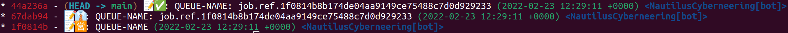

# Git Queue

<!-- markdownlint-disable-next-line MD013 -->
[](https://github.com/Nautilus-Cyberneering/git-queue/actions/workflows/check-dist.yml) [](https://github.com/Nautilus-Cyberneering/git-queue/actions/workflows/mega-linter.yml) [](https://github.com/Nautilus-Cyberneering/git-queue/actions/workflows/test.yml) [](https://github.com/Nautilus-Cyberneering/git-queue/actions/workflows/test-build.yml)

This GitHub Action is a job queue with the following characteristics:

- It only allows one pending job at the same time. [Multiple pending jobs feature](https://github.com/Nautilus-Cyberneering/git-queue/issues/6) is planned.
- Jobs are done by GitHub workflows intended to create git commits and merge them.
- It provides an optimistic locking mechanism to guarantee that commits are merged in a mutual exclusion way, avoiding duplicate commits. When the queue accepts more than one active (not finished) job it will also guarantee the execution order.

Formal definition:

> A job queue with concurrency optimistic lock mechanism to guarantee job execution order (by updating the job state), implemented with a event sourcing approach, using empty git commits as the event store. Currently with one pending-to-process job limit.

- [Features](#features)
- [Usage](#usage)
- [Customizing](#customizing)
  - [Inputs](#inputs)
  - [Outputs](#outputs)
  - [Environment variables](#environment-variables)
- [Development](#development)
  - [Commit conventions](#commit-conventions)
- [Release](#release)
- [Credits](#credits)
- [License](#license)

## Features

For the time being, it only allows one active (unfinished) job. Check the [Roadmap](https://github.com/Nautilus-Cyberneering/git-queue/issues/6) for upcoming features.

### When to use it

You can use it if:

- You have workflows running in parallel.
- The workflows are going to create new commits in a branch and those commits are going to be merged into another branch.
- And you want to coordinate them to avoid concurrency problems like duplicate commits or commits in the wrong order.

### Why to use it

There are other alternatives like [GitHub concurrency groups](https://docs.github.com/en/actions/using-jobs/using-concurrency), but:

- In some cases, it could be convenient not to couple your application to the GitHub infrastructure.
- Concurrency problems are very tricky to detect and solve. This solution offers a high level of traceability.
- This solution does not require external services, only Git.

### Use case

The problem this action was trying to solve initially was updating a submodule in a project when the submodule repository is updated.

- You have two Git repositories: `R1` and `R2`.
- `R1` is a submodule of `R2`.
- When a new commit is added to the main branch in `R1` we want to update the submodule in `R2`.
- We have a scheduled workflow `W` in `R2` to import the latest changes.


- `T1`. Add a new file to the library (`1.txt`)
- `T2`. We run `W1` to update the library, however, for some reason, this process takes more than 10 minutes.
- `T3`. We modify the file `1.txt` in the library.
- `T4`. (T2+10") We run a second workflow `W2` to update the library.
- `T5`. The workflow `W2` finishes and creates a commit with the second version of file `1.txt`.
- `T6`. The workflow `W1` finishes and overwrites the first version of the file `1.txt`.

## Usage

It requires to enable only fast forward merges.

It works on Linux, macOS and Windows [virtual environments](https://help.github.com/en/articles/virtual-environments-for-github-actions#supported-virtual-environments-and-hardware-resources).

The action has 3 different commands (specified by the input `action`):

- `create-job`: it allow tou to create a new job with any payload.
- `start-job`: it allows the workflow to create a commit when hte job process starts.
- `finished-job`: it allows the workflow to mark the nob as finished.

And one query (also specified by the input `action`):

- `next-job`: it returns the next pending to process job.

You should:

- Create a new Job (`create-job`) and push it immediately to the `main` branch (or whatever your PR target branch is).
- Later, a worker workflow can ask the queue for the next job (`next-job`). The first commit should be the start commit (`start-job`) and the latest one the finish commit (`finish-job`).

And the end of the process your `git log` output should be like this:



Sample workflow:

```yaml
name: your workflow

on:
  push:
    branches: [main]

jobs:
  build:
    runs-on: ubuntu-latest
    steps:
      - uses: actions/checkout@v2
        with:
          fetch-depth: 0

      - name: Set up git committer identity
        run: |
          git config --global user.name 'github-actions[bot]'
          git config --global user.email 'github-actions[bot]@users.noreply.github.com'

      - name: Install dependencies and build
        run: yarn install && yarn build && yarn package

      - name: Create a temp git dir
        run: |
          mkdir ${{ runner.temp }}/temp_git_dir
          cd ${{ runner.temp }}/temp_git_dir
          git config --global init.defaultBranch main
          git init
          git status

      - name: Create new job
        id: create-job
        uses: Nautilus-Cyberneering/git-queue@v1
        with:
          git_repo_dir: ${{ runner.temp }}/temp_git_dir
          queue_name: 'library update - library-aaa'
          action: 'create-job'
          job_payload: '{"field": "value", "state": "pending"}'

      - name: Mark job as started
        id: start-job
        if: ${{ steps.create-job.outputs.job_created == 'true' }}
        uses: Nautilus-Cyberneering/git-queue@v1
        with:
          git_repo_dir: ${{ runner.temp }}/temp_git_dir
          queue_name: 'library update - library-aaa'
          action: 'start-job'
          job_payload: '{"field": "value", "state": "started"}'

      - name: Mutual exclusion code
        if: ${{ steps.create-job.outputs.job_created == 'true' }}
        run: echo "Running the job that requires mutual exclusion"

      - name: Get next job
        id: get-next-job
        if: ${{ steps.create-job.outputs.job_created == 'true' }}
        uses: Nautilus-Cyberneering/git-queue@v1
        with:
          git_repo_dir: ${{ runner.temp }}/temp_git_dir
          queue_name: 'library update - library-aaa'
          action: 'next-job'

      - name: Mark job as finished
        id: finish-job
        if: ${{ steps.create-job.outputs.job_created == 'true' }}
        uses: Nautilus-Cyberneering/git-queue@v1
        with:
          git_repo_dir: ${{ runner.temp }}/temp_git_dir
          queue_name: 'library update - library-aaa'
          action: 'finish-job'
          job_payload: '{"field": "value", "state": "finished"}'

      - name: Show new commits
        run: |
          cd ${{ runner.temp }}/temp_git_dir
          git show --pretty="fuller" --show-signature ${{ steps.create-job.outputs.job_commit }}
          git show --pretty="fuller" --show-signature ${{ steps.start-job.outputs.job_commit }}
          git show --pretty="fuller" --show-signature ${{ steps.finish-job.outputs.job_commit }}
```

## Customizing

### Inputs

Following inputs are available:

| Name                     | Type   | Command | Query | Description                                                                                                                 |
|--------------------------|--------|---------|-------|-----------------------------------------------------------------------------------------------------------------------------|
| `queue_name`             | String | all     | all   | Queue name. It can not contain special characters or white spaces.                                                          |
| `action`                 | String | all     | all   | Queue actions: `create-job`, `next-job`, `start-job`, `finish-job`.                                                         |
| `job_payload`            | String | all     | none  | Job payload. It can be any string.                                                                                          |
| `git_repo_dir`           | String | all     | all   | The git repository directory. The default value is the current working dir.                                                 |
| `git_commit_gpg_sign`    | String | all     | none  | The git commit [--gpg-sign](https://git-scm.com/docs/git-commit#Documentation/git-commit.txt---gpg-signltkeyidgt) argument. |
| `git_commit_no_gpg_sign` | String | all     | none  | The git commit [--no-gpg-sign](https://git-scm.com/docs/git-commit#Documentation/git-commit.txt---no-gpg-sign) argument.    |

### Outputs

Following outputs are available:

| Name           | Type   | Command      | Query      | Description                                                                         |
|----------------|--------|--------------|------------|-------------------------------------------------------------------------------------|
| `job_created`  | String | `create-job` | none       | Boolean, `true` if the job was successfully created.                                |
| `job_started`  | String | `start-job`  | none       | Boolean, `true` if the job was successfully started.                                |
| `job_finished` | String | `finish-job` | none       | Boolean, `true` if the job was successfully finished.                               |
| `job_commit`   | String | all          | none       | The commit hash of the newly created commits, when the action creates a new commit. |
| `job_payload`  | String | none         | `next-job` | The job payload. Only for `next-job` action.                                        |

### Environment variables

If you need to pass environment variables to the `git` child process, you only need to set those variables by using the `env` section of the action:

```yml
- name: Create job
  id: create-job
  uses: Nautilus-Cyberneering/git-queue@v1
  with:
    queue_name: "Library Update - library-aaa"
    action: "create-job"
    job_payload: "job_payload"
  env:
    GNUPGHOME: '~/.gnupg'
    GIT_AUTHOR_NAME: 'A Committer'
    GIT_AUTHOR_EMAIL: 'committer@example.com'
    GIT_AUTHOR_DATE: '2005-04-07T22:13:13'
    GIT_COMMITTER_NAME: 'A Committer'
    GIT_COMMITTER_EMAIL: 'committer@example.com'
    GIT_COMMITTER_DATE: '2005-04-07T22:13:13'
```

## Development

Requirements:

- Node >= 16.13.2

Install:

```shell
yarn install
```

Build the typescript and package it for distribution:

```bash
yarn build && yarn package
```

Run all tests:

```shell
yarn test
```

Run the app locally:

```shell
yarn run build && \
INPUT_QUEUE_NAME="queue-name" \
INPUT_ACTION="next-job" \
  node dist/index.js
```

Run `TypeScript` linter:

```shell
yarn format && yarn lint
```

Run [MegaLinter](https://github.com/megalinter/megalinter) locally:

```shell
mega-linter-runner -e 'ENABLE=MARKDOWN'
```

You can use the `-e` option to select the linters you want to execute.

You can run workflows locally with [act](https://github.com/nektos/act).

### Commit conventions

General conventions:

- We follow [Conventional Commits Specification](https://www.conventionalcommits.org/en/v1.0.0/).
- When we integrate a new dependency, or upgrade dependencies, each indivisible dependency change (update, remove, add) should have it's own commit including:
  - Updated `package.json` file.
  - Updated `yarn.lock`.
  - Regenerated `dist` directory.
  - Updated documentation, if needed.
  - Minimal changes to the code to accommodate the change in the dependencies.

Conventions related to pull requests:

- We only allow rebase merges.
<!-- markdownlint-disable-next-line MD013 -->
- Pull request merges must be done using the console because [GitHub Rebase](https://docs.github.com/en/pull-requests/collaborating-with-pull-requests/incorporating-changes-from-a-pull-request/about-pull-request-merges) does not work exactly like [Git Rebase](https://git-scm.com/docs/git-rebase) and commits are re-created not signed.

Conventions related to releases:

- Every commit should build the application with: `yarn build && yarn package` because every single commit should be executable on a third party workflow and the action has to be already built in the `dist` folder.
<!-- markdownlint-disable-next-line MD013 -->
- In some cases, commits are generated automatically, for example by the `dependabot` or `MegaLinter` (if enabled). Those bots do not build and package the action, so whoever is responsible for merging those commits should change them to include the built app. That could be a very tedious work so very often could be more convenient just to re-create manually those changes including the built app (for example when you are updating some node packages at the same time). The same logic applies to signed commits (`dependabot` creates signed commits but `MegaLinter` does not), that's one of the the reasons why auto-fix is not enabled for `MegaLinter`.
<!-- markdownlint-disable-next-line MD013 -->
- For some commits, the `dist` folder might not be affected, which means if you run `yarn build && yarn package` again the commit content for the `dist` folder is not going to change. In such cases, you could merge `dependabot` commits directly from the GitHub interface. That happens when `dependabot` upgrades an action in a workflow. In general, changes in `.github` folder do not affect the `dist` folder.

## Release

Please read [commit conventions](#commit-conventions) related to releases.

### Publish to a distribution branch

Actions are run from GitHub repos so we will check in the packed dist folder.

Then run [ncc](https://github.com/zeit/ncc) and push the results:

```bash
yarn package
git add dist
git commit -a -m "prod dependencies"
git push origin releases/v1
```

Note: We recommend using the `--license` option for ncc, which will create a license file for all of the production node modules used in your project.

Your action is now published! :rocket:

See the [versioning documentation](https://github.com/actions/toolkit/blob/master/docs/action-versioning.md)

### Action versioning

After testing, you can [create a v1 tag](https://github.com/actions/toolkit/blob/master/docs/action-versioning.md) to reference the stable and latest V1 action.

## Credits

Original idea by [Cameron Garnham](https://github.com/da2ce7).

The [gpg.ts](src/__tests__/gpg.ts) and [openpgp.ts](src/__tests__/openpgp.ts) files were originally copied from this [GitHub Action repository](https://github.com/crazy-max/ghaction-import-gpg).

## License

MIT. See `LICENSE` for more details.
